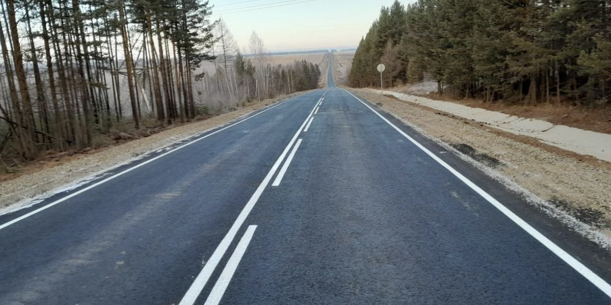
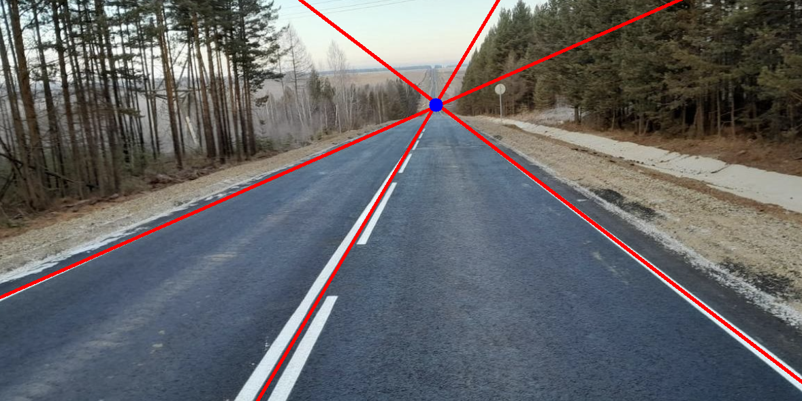

# Lane Marking Detection

This project implements a basic lane detection and intersection point estimation algorithm using Python and OpenCV. It processes a road image to identify lane markings and estimates the intersection point

## Key Steps:

1.  **Image Preprocessing:** Convert the image to grayscale and applie thresholding to isolate lane markings.
2.  **Line Detection:** Use the Hough Transform to detect lines in the processed image.
3.  **Line Clustering:** Group detected lines using K-Means clustering to identify lane candidates.
4.  **Itersection Point Calculation:** Calculate the intersection point of the clustered lines.

## Dependencies:
* Python 3.10+
* OpenCV
* NumPy
* Matplotlib
* Scikit-learn 

## Result:
 
